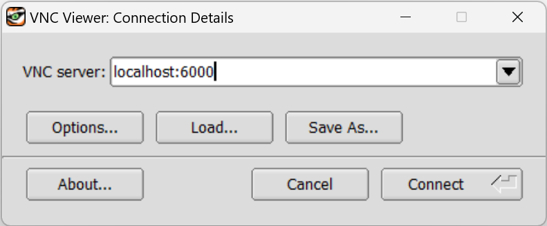
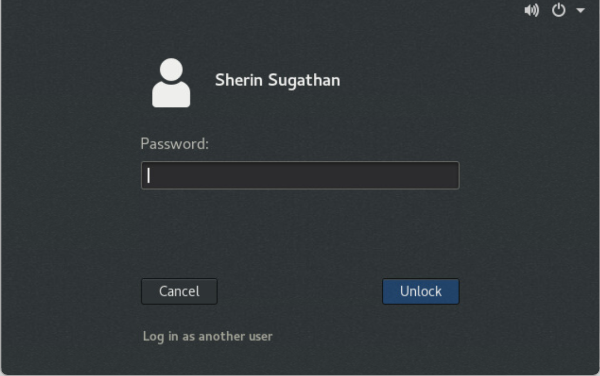
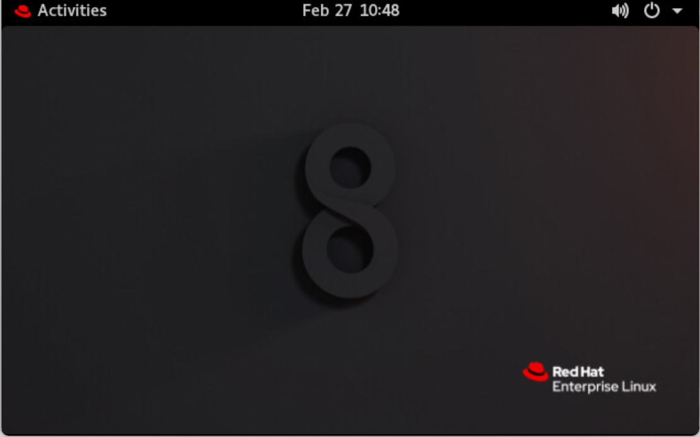

# GeoVis
Global climate datasets, whether from satellite observations or from models, are often enormous in scope and thus challenging to visualize in effective ways. This is especially true in popular scientific presentations and in teaching situations where strong visual ‘effects’ are increasingly expected by the public. This tool serves as an aid to researchers for communicating science through effective visuals.
<p align="center">
  
</p>

## I. Steps for Running GeoVis Under MIMI
MIMI (mimi.uio.no) is a shared computing resource at the Department of GeoSciences (UiO). It is an RHEL8 machine with 128 cores and a Quadro RTX 6000. 
### a. Software Needed
- TigerVNC Client - https://github.com/TigerVNC/tigervnc/releases
### b. Setting up a VNCServer and establishing connection. 
1. Login to mimi using your credentials.
2. Before starting TurboVNC Server, load the module ``$ module load TurboVNC/3.0.1-GCCcore-11.3.0``
3. Start the server with the command``$ vncserver``

Note: When you first run vncserver on the remote machine, you'll be prompted to create a password. Choose a password that's different from your UiO password due to the weak encryption of VNC passwords. If asked about setting a view-only password, select 'no'. After starting vncserver, you'll receive a similar message as shown below.

```python
Desktop 'TurboVNC: mimi.uio.no:4 (sherinsu)' started on display mimi.uio.no:4
Starting applications specified in /opt/TurboVNC/3.0.1-GCCcore-11.3.0/bin/xstartup.turbovnc
Log file is /home/sherinsu/.vnc/mimi.uio.no:4.log
```
4. To verify vncserver is active, execute the command: `$ vncserver -list`. Then you should see the following as the output:
```python
TurboVNC sessions:
X DISPLAY #     PROCESS ID      NOVNC PROCESS ID
:4              1883511
```
5. Log out from mimi.
6. To access the remote VNC server, we need to initiate a connection that bridges local and remote systems through ssh's port forwarding capability. For this, determine the port number you must forward by calculating it as:
`PORT = 5900 + N`, where `N` is the display port that was assigned to you when you started the server in Step 3. In the above example, the display port number is `4`, so the value of `PORT` we should use is `5904`. Open a new terminal or command prompt and run the following command by replacing 'username' with your mimi username.
```python
ssh -L 6000:localhost:5904 username@mimi.uio.no 
```
7. Now, for connecting to remote server running in mimi, you can launch  TigerVNC Viewer and enter the server name as `localhost:6000` and press Connect.

<p align="center">
  
</p>
8. Once you are successfully connected, you should see a remote desktop as shown below:
<p align="center" style="display: block">
  
</p>


### c. Running GeoVis
1. Open a terminal and set the following variables.
```python
$ export __NV_PRIME_RENDER_OFFLOAD=1
$ export __GLX_VENDOR_LIBRARY_NAME=nvidia
```
2. Clone the repository - `git clone https://github.com/sherinsugathan/GeoVis.git`
3. Install dependencies.
   `$ pip install -r requirements.txt`
4. Run `python mainWindow.py`.


The first variable will tell the system to offload the rendering to the discrete card, the second variable will force applications to use the NVIDIA's GLX stuff.


## II. Steps for Running GeoVis Under EduCloud OnDemand
Educloud On Demand is a service within the Educloud research infrastructure that enables running interactive, and/or graphical applications on the Fox HPC cluster. Unlike mimi, Fox cluster is hosting more advanced GPUs that can help render large datasets.
### a. Software Needed
- Any modern browser
### b. Running GeoVis
1. Go to https://ondemand.educloud.no/ and login using educloud credentials. If you don't have an educloud already, visit https://research.educloud.no/ to apply for access to Educloud Research.
2. Choose Fox Desktop from the available apps.
3. In the next page, hit `Launch` after choosing your educloud project name, GPU and required runtime.
4. Once your instance is allocated, run the instance.
5. Once the instance is started, you will see a linux desktop. Open a terminal and follow the same steps as provided in I.(c).

## III. Steps for Running GeoVis Locally
If you have a decent GPU in your local computer, you can follow the below steps to run:
1. Clone the repository - `git clone https://github.com/sherinsugathan/GeoVis.git`
2. Install dependencies.
   `$ pip install -r requirements.txt`
3. Run `python mainWindow.py`.

## IV. Sample dataset
The sample dataset used in the screenshots is a temporal dataset. If you wish to the download the same dataset, click [here](https://uio-my.sharepoint.com/:u:/g/personal/sherinsu_uio_no/ER7m6NV5_HlLupdAsknUAgIBAsF_WQDDfhycW_jr5vSaJw?e=rn7ga0)

## V. Issue Reporting
If you encounter any bugs or issues while using the scripts, please report them in the Issues section. Include a brief description of the problem and steps to reproduce it. 
